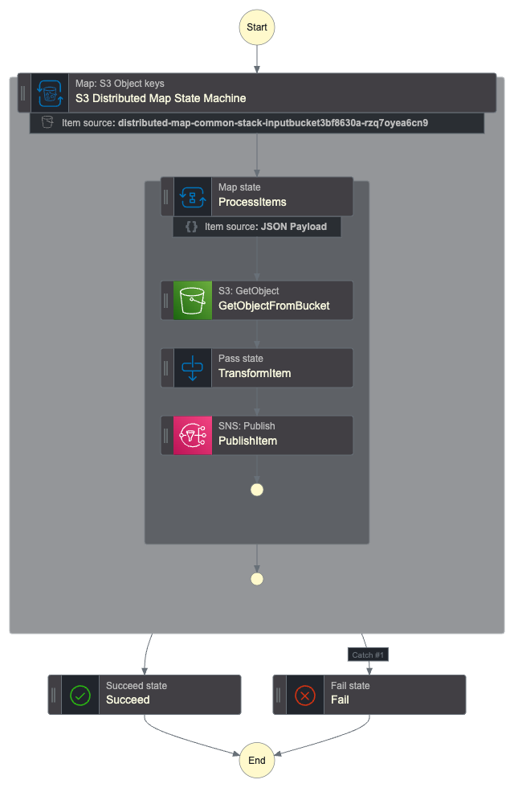
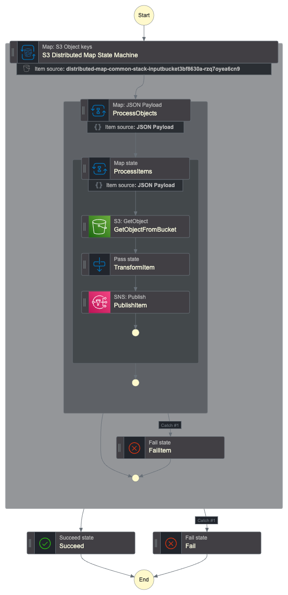

# S3 Objects manipulation Distributed Map

This is an AWS CDK template for exploring the Step Functions Distributed Map capabilities and how to tackle the need of an increased paralelism.

This example is realized following the official [Aws Documentation](https://docs.aws.amazon.com/step-functions/latest/dg/use-dist-map-orchestrate-large-scale-parallel-workloads.html) and the consideration and concepts explored in [AWS Blog News](https://aws.amazon.com/blogs/aws/step-functions-distributed-map-a-serverless-solution-for-large-scale-parallel-data-processing).

Important: this application uses various AWS services and there are costs associated with these services after the Free Tier usage - please see the [AWS Pricing page](https://aws.amazon.com/pricing/) for details. You are responsible for any AWS costs incurred. No warranty is implied in this example.

## Requirements

* [AWS CLI](https://docs.aws.amazon.com/cli/latest/userguide/install-cliv2.html) installed and configured
* [Git Installed](https://git-scm.com/book/en/v2/Getting-Started-Installing-Git)
* [AWS CDK Installed](https://docs.aws.amazon.com/cdk/v2/guide/getting_started.html#getting_started_install)

## Deployment Instructions

## The repository has 3 subdirectories

    - Common
    - SimpleDistributedMaps
    - NestedDistributedMap
    - Respurces

## Step 1 ( Installing Common )

    ```bash
    cd Common && npm install && npm run cdk:deploy
    ```

This deployment create the s3 bucket and SNS topic used by workflows.

## Step 2 ( Deploying SimpleDistributedMaps)

    ```bash
    cd SimpleDistributedMaps && npm install && npm run cdk:deploy
    ```



### Step 3 ( Deploying NestedDistributedMap)

    ```bash
    cd NestedDistributedMap && npm install && npm run cdk:deploy
    ```



### Step 4 ( Seeding S3 Bucket )

Run this command to create a number of files before deployment and feed the S3 bucket as source of data for state matchine workflows. the following shell script copie in each iteration 1000 tile the example.json file and sync the temporary assets folder with s3 bucket created in Step 1.

Note: Please replace `<S3-Bucket-Name>` with the bucket arn in Parameter store.

    ```shell
        cd resources && for j in {1..1000}; do mkdir assets && for i in {1..100}; do cp example1.json assets/"example$j-$i.json"; done; aws s3 sync assets s3://<S3-Bucket-Name>; rm -rf assets ; done;
    ```

## Testing

The Step Function can be triggered without worring about payload, there is not input required to run the executions.

## Destroy

To Destroy resources in any folder run following command

    ```bash
    npm run cdk:destroy
    ```

> The Common Destroy will auto delete all s3 bucket objects before bucket deletion, but this can fail based on number of files you generate, to avoid this you can Empty the bucket in the AWS Management Console as its a faster.
